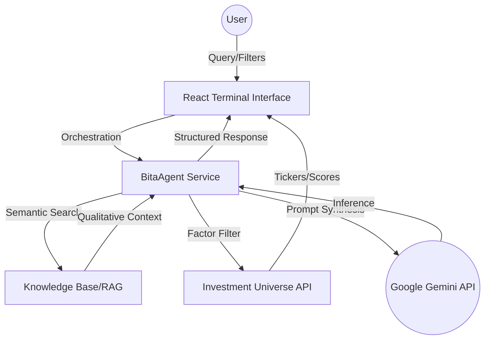
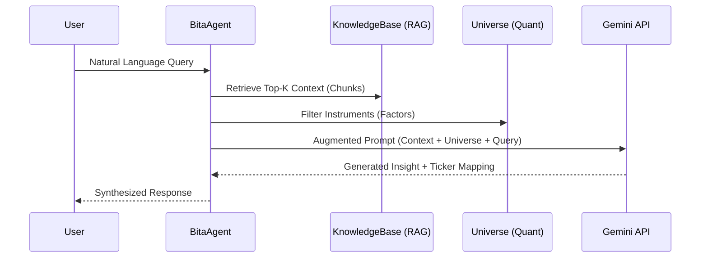

# BITA Intelligence Terminal 

## 🚀 Project Phase: Internal Alpha [v0.8]
Currently in functional prototype stage focusing on core orchestration and factor-based retrieval.

## 🏗️ Technical Architecture
The BITA architecture follows a **RAG-Agentic** pattern where a central Orchestrator manages state and tool usage to bridge qualitative research with quantitative factor analysis.

## 🧠 RAG Agentic AI Implementation
Our implementation utilizes a multi-stage pipeline to ensure grounding in actual financial data:

1. **Extraction**: Mapping user intent to quantitative filter parameters (Sectors, Geography, ESG).
2. **Retrieval**: Fetching relevant qualitative chunks from the `knowledgeService` (Semantic Context).
3. **Grounding**: Injecting real-time instrument data from the `universeService` into the LLM context.
4. **Synthesis**: Generating professional-grade reports with specific ticker mappings.

## 📋 Core Modules

### 1. Universe Explorer
The central hub for multi-factor investment universe construction.
- **Factor Filtering**: Filter securities by Sector, Theme, and quantitative factors.
- **Theme Highlighting**: Visual mapping of megatrends (e.g., AI/GPU, Lithium Transition) to specific ticker exposures.
- **Dynamic Configuration**: 
  - **Column Management**: Toggle visibility of key metrics like P/E Ratio, Market Cap, and ESG scores.
  - **Real-time Live Mode**: Simulates live market data updates for score tracking.

### 2. Chat Terminal (RAG-Agentic)
A semantic research engine powered by Google Gemini.
- **Orchestrator**: Manages conversational state and intent detection.
- **Semantic Search**: Maps natural language queries to financial factors and megatrends.
- **Investment Insights**: Generates qualitative analysis based on point-in-time financial identifiers.

### 3. Portfolio Dashboard
Real-time tracking of simulated investment positions.
- **Position Tracking**: Monitor gains/losses and capital allocation.
- **Risk Metrics**: Simplified view of portfolio health and exposure.

### 4. Strategy Builder
Construct and backtest investment strategies based on thematic filters and factor scoring.
- **Universe Drafting**: Assemble custom universes for targeted thematic exposure.
- **Logic Mapping**: Define how factors weight into the final investment signal.

## 🛠️ Next Scaffolding Suggestions [Beta v1.0]

- **Database Integration**: Migrate Knowledge Base and Portfolio from `localStorage` to **Firebase Firestore** for persistent multi-user support.
- **Real-time News Vectorization**: Implement an automated pipeline to vectorize financial news into the RAG engine via Gemini Embeddings.
- **Advanced Prompt Engineering**: Implement specialized system instructions for different "Analyst Personas" (e.g., Value Investing vs. Momentum).
- **Execution Workflow**: Add "Click-to-Trade" modal to simulate order execution with slippage and commission calculations.

## 📱 Mobile Experience
The terminal includes a dedicated mobile-responsive interface with a bottom navigation bar for quick access to core modules.

---
*BITA Command Agent | Built for Precision Quantitative Finance.*
