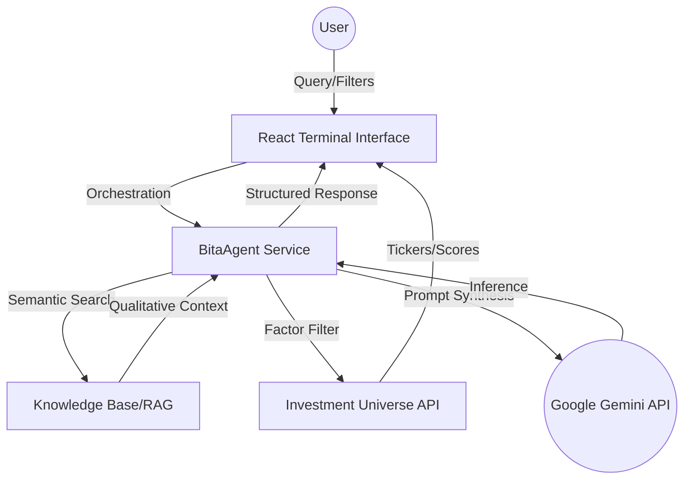

# BITA Intelligence Terminal 

## 🚀 Project Status: Internal Alpha [v0.9]
The terminal is now equipped with advanced analytics, improved RAG research capabilities, and customizable intelligence views for professional-grade quantitative finance.

## 🏗️ Technical Architecture
The BITA architecture follows a **RAG-Agentic** pattern where a central Orchestrator manages state and tool usage to bridge qualitative research with quantitative factor analysis.

## 🧠 Features & Modules

### 1. Universe Explorer
The central hub for multi-factor investment universe construction.
- **Factor Filtering**: Filter securities by Sector, Theme, and quantitative factors.
- **Theme Highlighting**: Visual mapping of megatrends to specific ticker exposures.
- **Saved Views**: Create, name, and load custom filter configurations for rapid research.
- **Dynamic Configuration**: Column management and real-time visualization toggles.

### 2. Analytics Dashboard
Advanced visualization for portfolio and market analytics.
- **Performance Attribution**: Interactive performance tracking with selectable timeframes (7D, 30D, 90D).
- **Market Breakdown**: Visualizations for Geographic and Sector exposure.
- **ESG & Controversy Metrics**: Aggregated ESG scoring, carbon intensity, and controversy levels.

### 3. Chat Terminal (RAG-Agentic)
A semantic research engine powered by Google Gemini.
- **Enhanced RAG Process**: Upload documents to extract features, embed chunks, and compute semantic similarity. Prioritizes context chunks with high (>0.6) similarity scores for precise AI grounding.
- **Intent Detection**: Orchestrates intent and financial data synthesis.

### 4. System Integrity & Security
- **API Key Hardening**: Environment variable validation ensures `GEMINI_API_KEY` is correctly configured and present before any service initialization.

---

## 🛠️ Roadmap Suggestions [v1.0]
- **Firebase Integration**: Migrate to Firebase Firestore for multi-user state persistence.
- **Market News Pipeline**: Automate financial news vectorization via Gemini Embeddings.
- **Analyst Personas**: Specialized system instructions for diverse investment styles (Value, Growth, Momentum).
- **Order Execution**: Simulate "Click-to-Trade" workflows with realistic slippage.
- **Mobile Experience**: Dedicated mobile-responsive navigation and interface.

---
*BITA Command Agent | Built for Precision Quantitative Finance.*
